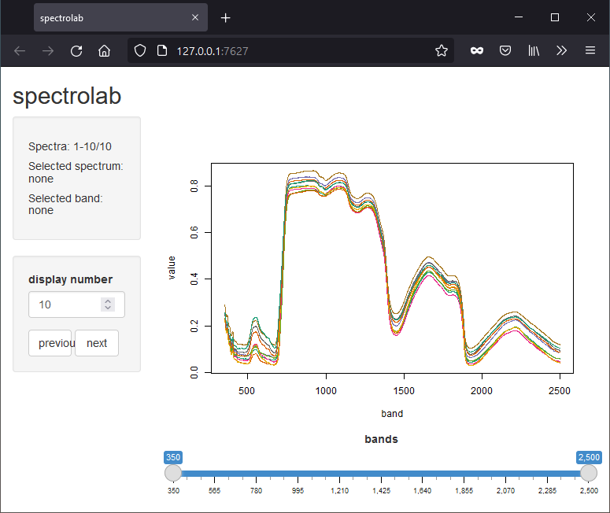

# 1 Ordnerstruktur
Bevor Sie mit der Analyse beginnen, organisieren Sie sich Ihre Messdaten. Jede Probe des Spectral Evolution RS-3500 liegt in jeweils einer Datei des Formate `*.sed` und `*.raw` vor. Legen Sie auf Ihrem Rechner eine Ordnerstruktur an, sodass für jede Oberfläche ein eigener Ordner bereitliegt. Kopieren Sie die einzelnen Proben dann entsprechend Ihrer Geländenotizen in den richtigen Ordner. Die Geländenotizen aus diesem Beispiel finden Sie in der Datei `raw_data_backup/Probes.xlsx`.

| Probe | Surface    | Comment                  |
|-------|------------|--------------------------|
| 1     | concrete   |                          |
| 2     | concrete   |                          |
| 3     | concrete   |                          |
| 4     | concrete   |                          |
| 5     | concrete   |                          |
| 6     | vegetation | Hedera helix, upper side |
| 7     | vegetation | Hedera helix, upper side |
| 8     | vegetation | Hedera helix, upper side |
| 9     | vegetation | Hedera helix, upper side |
| 10    | vegetation | Hedera helix, upper side |
| 11    | vegetation | Hedera helix, lower side |
| 12    | vegetation | Hedera helix, lower side |
| 13    | vegetation | Hedera helix, lower side |
| 14    | vegetation | Hedera helix, lower side |
| 15    | vegetation | Hedera helix, lower side |


Hier sehen Sie ein Beispiel, wie so eine Ordnerstruktur aussehen könnte, wenn Betonoberflächen und Vegetation untersucht werden sollen. Es empfiehlt sich, auch direkt einen Ordner `raw_data_backup` für Backups aller Proben anzulegen, sowie Ordner für das Skript `script` und die Zwischenergebnisse `work`.

```
.
├── raw_data_backup
│   ├── Probes.xlsx
│   ├── probe1.sed
│   ├── probe1.raw
│   ├── probe2.sed
│   ├── probe2.raw
│   ├── probe3.sed
│   ├── probe3.raw
│   ├── probe4.sed
│   ├── probe4.raw
│   └── ...
├── surface_concrete
│   ├── probe1.sed
│   ├── probe2.sed
│   └── ...
├── surface_vegetation
│   ├── probe6.sed
│   ├── probe7.sed
│   └── ...
├── work
└── analysis_script.R
```

# 2 Voreinstellung in R
## 2.1 R Projekt anlegen
Öffnen Sie die Software R, idealerweise mit der Benutzeroberfläche RStudio und legen Sie eine neue Datei namens `analysis_script.R` im `root` Ordner an.
Legen Sie in diesem Skript auch die Working Directory auf den bereits angelegten Ordner `work` fest.
```{r eval=FALSE}
# Set full path
setwd('C:/your_path/work')
```

```{r include=FALSE}
# Set full path
setwd('C:/data/Lehre/GEO87/hyspec/work')
```

## 2.2 Spectrolab installieren
Installieren Sie bei der ersten Verwedung das Package Spectrolab über Rstudio oder den Befehl:
```{r eval=FALSE}
# Install package
install.packages('spectrolab')
```

Alternativ zu den oben genannten Methoden können Sie Spectrolab auch direkt aus dem [Github Repository](https://github.com/meireles/spectrolab) installieren. Beachten Sie, dass dazu die Installation des Packages `devtools` vorausgesetzt wird.
```{r eval=FALSE}
# Install package from github
library('devtools')
install_github('meireles/spectrolab')
```


## 2.3 Spectrolab laden
Wenn das Package einmal installiert ist, können Sie es in jeder Session mit dem folgenden Befehl laden:
```{r message=FALSE, warning=FALSE, paged.print=FALSE}
# Load package
library('spectrolab')
```


# 3 Analysen in Spectrolab
## 3.1 Dateien importieren
Sie können mit dem Befehl `read_spectra` alle Proben eines Ordners importieren. Lesen Sie sich die [Dokumentation](https://www.rdocumentation.org/packages/spectrolab/versions/0.0.12/topics/read_spectra) des Befehls durch und informieren Sie sich, was die Argumente `path`, `format`, `recursive`, `exclude_if_matches` und `ignore_extension` bedeuten.

In diesem Beispiel wird der Pfad des Pfad des Ordners `folder_vegetation` definiert und anschließend dessen Inhalt mittels `read_spectra` in die Variable `spectra_concrete` eingelesen.
```{r}
# Define path to probes
folder_vegetation <- './surface_vegetation'

# Import probes to variable
spectra_vegetation <- read_spectra(path = folder_vegetation,
                        format = "sed",
                        recursive = "false",
                        exclude_if_matches = FALSE,
                        ignore_extension = FALSE)
```

## 3.2 Daten und Metadaten auslesen
Sie können eine Vielzahl an Metadaten, Tabellen und Werten aus der Variable `spectra_vegetation` auslesen.
Wenn Sie einfach den Namen der Variable ausführen erhalten Sie eine einfache Statistik zur Anzahl der Proben und eine Übersicht über die Wellenlängen.
```{r}
# Summary
spectra_vegetation
```
Diese Dimensionen können sie auch mit dem Befehl `dim` abfragen.
```{r}
# Dimensions
dim(spectra_vegetation)
```
Durch den Befehl `names` erhalten Sie die Dateinamen ihrer Proben.
```{r}
# Filenames
names(spectra_vegetation)
```
Falls Metadaten bei der Datenerfassung aufgezeichent wurden, lassen sich diese mit `meta` auslesen.
```{r message=FALSE, warning=FALSE, paged.print=FALSE}
# Metadata
meta(spectra_vegetation) #just in case these exist
```


## 3.3 Darstellung der Spektraldaten
### 3.3.1 Einfache Plots
Spektrolab Variablen können einfach mit dem Befehl `plot` visualisiert werden. Ein einfacher Plot zeigt die Signaturen aller Proben in der Variable an. Die Darstellung kann mit den für R üblichen Argumenten manipuliert werden. Sind Ihnen diese unbekannt, ist hier eine  [Übsersicht](https://www.r-graph-gallery.com/6-graph-parameters-reminder.html) zu finden.
```{r eval=FALSE}
# Simple plot
plot(spectra_vegetation)

# Customized plot
plot(spectra_vegetation, lwd=.75, lty=1, col='darkgreen', main='Vegetation')
```
```{r echo=FALSE}
# Simple plot
plot(spectra_vegetation)
```

*Aufgabe: Benennen Sie die Spektralbereiche mit hoher Reflektanz bzw. mit hoher Absorption der Vegetationsoberfläche.*

Mittels des Arguments `add=TRUE` können Sie auch mehrere Daten in einem Plot übereinanderlegen. Im folgenden Beispiel werden zusätzlich die Daten der Betonoberflächen importiert und gemeinsam mit den Vegetationsdaten dargestellt.
```{r}
# Define path to probes
folder_concrete <- './surface_concrete'

# Import probes to variable
spectra_concrete <- read_spectra(path = folder_concrete,
                      format = "sed",
                      recursive = "false",
                      exclude_if_matches = FALSE,
                      ignore_extension = FALSE)

# Combined plot
plot(spectra_vegetation, lwd=.75, lty=1, col='darkgreen')
plot(spectra_concrete, lwd=.75, lty=1, col='grey', add=TRUE)
```

*Aufgabe: Welche Spektralbereiche eignen sich besonders gut, um eine der beiden Oberflächen mittels eines Band Ratios hervorzuheben und von der anderen Oberfläche abzugrenzen*

### 3.3.2 Analytische Plots
Bei einer hohen Anzahl an Proben empfiehlt es sich, diese zu Quantilsbereichen zusammenzufassen. Dadurch lassen sich auch etwaige Ausreisser besser eliminieren. Die Breite des Quantils kann im Befehl `plot_quantile` mit dem Argument `total_prob` gesteuert werden.
Im folgenden Beispiel wird ein Plot mit dem 80%-Quantil angelegt, der dann mit den Kurven der Einzelproben überlagert wird.
```{r}
# Analytica plot
plot_quantile(spectra_vegetation, total_prob=.8, col='green', border=FALSE)
plot(spectra_vegetation, lwd=.75, lty=1, col='darkgreen', main='Vegatation', add=TRUE)
```

### 3.3.3 Plots mit Bandinformationen
Gerade in Hinblick auf die Auswertung der Signaturen für Fernerkundungszwecke ist es praktisch, die spektralen Bandbereiche diverser Sensoren darzustellen. Dadurch kann die Reflektion der Oberfläche in den verschiedenen Bandbereichen visuell interpretiert und sinnvolle Bandkombinationen mittels Indikatoren (wie Band Difference, Band Ratio, Normalized Band Ratios) beurteilt werden.
Die Bandinformationen können mit `plot_regions` dargestellt werden. Welche Bänder visualisiert werden sollen, lässt sich mit dem Argument `regions` festelgen, das mit dem Wert `default_spec_regions()` Standardbereiche des elektromagnetischen Spektrums liefert.
```{r}
# Plot wavelength regions
plot_quantile(spectra_vegetation, total_prob=.8, col='green', border=FALSE)
plot(spectra_vegetation, lwd=.75, lty=1, col='darkgreen', main='Vegatation', add=TRUE)
plot_regions(spectra_vegetation, regions=default_spec_regions(), add=TRUE)
```

Sie können aber auch eigene Wellenlängenbereiche, wie eben die der Fernerkundungssensoren definieren. In diesem Beispiel sehen Sie, wie die Bänder von [Sentinel-2](https://sentinels.copernicus.eu/web/sentinel/user-guides/sentinel-2-msi/resolutions/radiometric) aufgrund der Wellenlänge in nm definiert werden.
```{r}
# Plot Sentinel-2 band regions
Sentinel2_regions <- cbind("1" = c(begin=421, end=457),
                           "2" = c(begin=439, end=535),
                           "3" = c(begin=537, end=582),
                           "4" = c(begin=646, end=685),
                           "5" = c(begin=694, end=714),
                           "6" = c(begin=731, end=749),
                           "7" = c(begin=768, end=796),
                           "8" = c(begin=767, end=908),
                           "9" = c(begin=931, end=958),
                           "10" = c(begin=1338, end=1414),
                           "11" = c(begin=1539, end=1681),
                           "12" = c(begin=2194, end=2312))

plot_quantile(spectra_vegetation, total_prob=.8, col='green', border=FALSE)
plot(spectra_vegetation, lwd=.75, lty=1, col='darkgreen', main='Vegatation', add=TRUE)
plot_regions(spectra_vegetation, regions=Sentinel2_regions, add=TRUE)
```

*Aufgabe: Recherchieren Sie, mit welchen Bändern der NDVI bei Sentinel-2 berechnet wird. Warum sind genau diese beiden Bänder so sinnvoll?*

### 3.3.4 Interactive plot
Desweiteren können Sie Ihre Messergebnisse in einem interaktiven Plot über Ihren Browser darstellen. Dazu sollte zusätzlich das Package `shiny` installiert sein.
```{r eval=FALSE}
plot_interactive(spectra_vegetation)
```




# 4 Continuum Removal
Das Continuum Removal wird mit dem Package `prospectr` durchgeführt, das Sie ähnlich wie Spectrolab installiere und laden können.
```{r eval=FALSE}
# Install package
install.packages(prospectr)
```
```{r message=FALSE, warning=FALSE}
# Load package
library(prospectr)
```

Mit dem folgenden Skript werden die bereits geladenen Spectrolab Dateien in ein Tabellenformat umgewandelt, das von Prospectr gelesen werden kann. Anschließend wird das Continuum Removal durchgeführt und das Ergebnis wieder zurück in das Format von Spectrolab konvertiert.

```{r}
# Convert to matrix
vegetation_matrix <- as.matrix(spectra_vegetation)

# Perform continuum removal
vegetation_matrix_cr <- continuumRemoval(vegetation_matrix, type="R", interpol="linear", method="division")

# Convert back to Spectrolab type
colnames(vegetation_matrix_cr) <- colnames(vegetation_matrix)
spectra_vegetation_cr <- as_spectra(vegetation_matrix_cr)
```

```{r}
plot(spectra_vegetation_cr)
```

*Aufgabe: Welche Spektralbereiche sind besonders gut geeignet, die Klasse Vegetation weiter zu differenzieren?*

# 5 Links
* Alle Resourcen zu Spektrolab in der [CRAN-Bibliothek](https://cran.r-project.org/web/packages/spectrolab/)
  * [Vignette](https://cran.r-project.org/web/packages/spectrolab/spectrolab.pdf) mit allen Befehlen
  * [Tutorial](https://cran.r-project.org/web/packages/spectrolab/vignettes/introduction_to_spectrolab.pdf) * Spectrolab auf [rdocumentation.com](https://www.rdocumentation.org/packages/spectrolab/versions/0.0.12)
* Spectrolab auf [rdrr.io](https://rdrr.io/cran/spectrolab/man/read_spectra.html)

